# leaf - Démo des fonctionnalités

**leaf** est un prévisualiseur Markdown en terminal avec coloration syntaxique, rendu LaTeX, diagrammes Mermaid, support de thèmes et navigation interactive.

## Fonctionnalités interactives

### Mode Watch

**leaf** peut surveiller votre fichier et recharger automatiquement l'aperçu lors de modifications. La barre de statut affiche un indicateur "reloaded" lorsque le fichier est mis à jour. La position de défilement est préservée.

- Appuyez sur `w` ou `Ctrl+W` pour activer/désactiver le mode watch
- Appuyez sur `r` ou `Ctrl+R` pour recharger manuellement le fichier
- Utilisez le flag `--watch` au démarrage : `leaf --watch fichier.md`

Source: [demo-watch-mode.md](sources/demo-watch-mode.md)

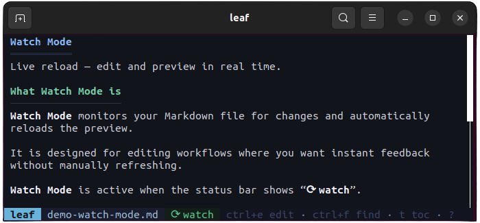

### Ouverture dans un éditeur

Ouvrez rapidement le fichier courant dans votre éditeur externe préféré sans quitter **leaf**. Au retour, le fichier est automatiquement rechargé avec les dernières modifications.

- Appuyez sur `Ctrl+E` pour ouvrir dans l'éditeur configuré
- Appuyez sur `Shift+E` pour choisir un éditeur (nano, vim, code, subl, emacs)
- Utilisez le flag `--editor` au démarrage : `leaf --editor vim fichier.md`

Source: [demo-open-editor.md](sources/demo-open-editor.md)

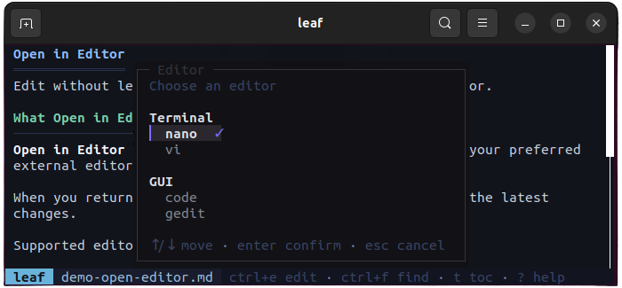

### Sélecteur de fichiers

Parcourez et ouvrez des fichiers Markdown sans quitter **leaf**. Deux modes sont disponibles : un sélecteur fuzzy pour rechercher rapidement par nom, et un navigateur de dossiers pour parcourir l'arborescence.

- Appuyez sur `Ctrl+P` pour le sélecteur fuzzy
- Appuyez sur `Shift+P` pour le navigateur de dossiers
- Utilisez le flag `--picker` au démarrage : `leaf --picker`

Source: [demo-file-picker.md](sources/demo-file-picker.md)

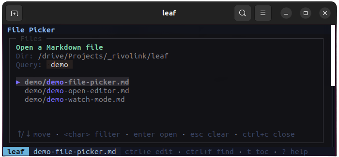

### Table des matières

Une barre latérale affiche la structure des titres du document pour une navigation rapide. **leaf** normalise intelligemment les niveaux de titres et met en surbrillance la section actuellement visible.

- Appuyez sur `t` pour afficher/masquer la table des matières
- Appuyez sur `1-9` pour sauter directement à un titre

Source: [demo-toc-sidebar.md](sources/demo-toc-sidebar.md)

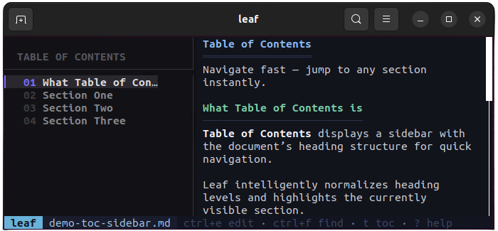

### Recherche

Recherche plein texte avec surlignage visuel de toutes les correspondances. Naviguez entre les résultats avec un compteur affiché dans la barre de statut.

- Appuyez sur `/` ou `Ctrl+F` pour lancer la recherche
- Appuyez sur `n` pour aller au résultat suivant
- Appuyez sur `Shift+N` pour aller au résultat précédent

Source: [demo-search.md](sources/demo-search.md)

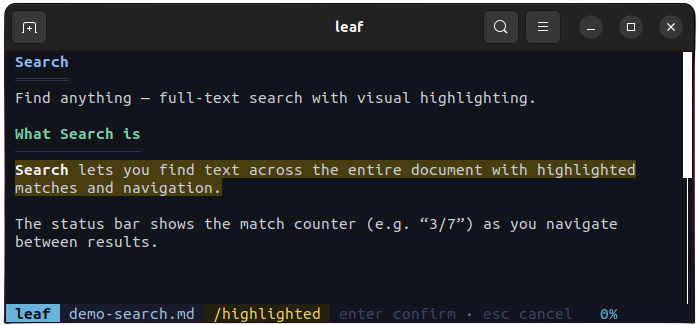

**Et aussi :**
- **Mise à jour automatique** : lancez `leaf --update` pour vérifier et installer la dernière version depuis GitHub avec vérification SHA256
- **Support stdin** : envoyez du Markdown via un pipe avec `echo '# Bonjour' | leaf` (jusqu'à 8 Mo)
- **Barre de statut** : affiche le nom du fichier, l'indicateur watch, le statut de recherche et le pourcentage de défilement
- **Modal d'aide** : appuyez sur `?` pour afficher tous les raccourcis clavier organisés par catégorie

## Rendu Markdown

### LaTeX / Math

**leaf** rend les formules mathématiques directement dans le terminal — une fonctionnalité rare pour un viewer en terminal. Les formules inline avec `$...$` et les formules en bloc avec `$$...$$` sont converties en symboles Unicode.

Supporté : fractions, exposants, indices, lettres grecques, racines, et plus encore. Les blocs de code en langage `latex` ou `tex` sont également rendus.

Source: [demo-latex-render.md](sources/demo-latex-render.md)

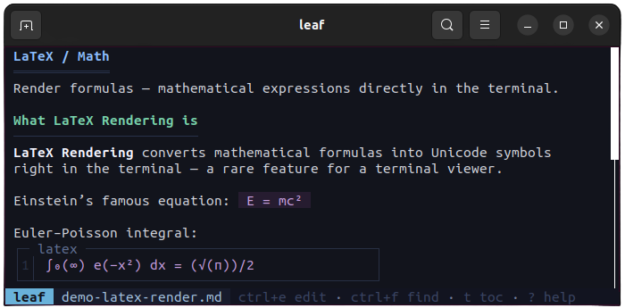

### Diagrammes Mermaid

**leaf** rend les diagrammes Mermaid en ASCII art visuel directement dans le terminal. Les flowcharts, diagrammes de séquence et pie charts sont convertis depuis leurs définitions textuelles en représentations avec caractères de dessin. Les types de diagrammes non supportés affichent le source avec coloration syntaxique.

Source: [demo-mermaid-render.md](sources/demo-mermaid-render.md)

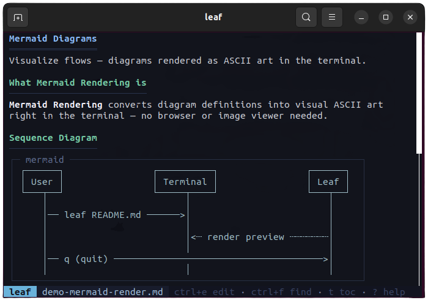

### Blocs de code avec coloration syntaxique

Les blocs de code sont affichés dans un cadre décoratif avec le label du langage et des numéros de ligne. La coloration syntaxique supporte plus de 40 langages (Rust, Python, JavaScript, TypeScript, Go, C/C++, Java, etc.) via la bibliothèque syntect.

Les blocs de code s'adaptent à la largeur du terminal avec un retour à la ligne intelligent.

Source: [demo-code-syntax.md](sources/demo-code-syntax.md)

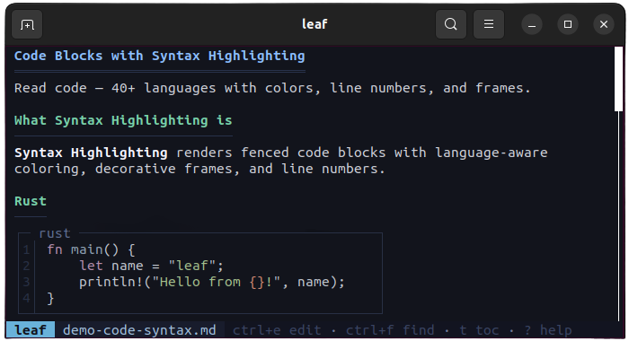

### Tableaux

Les tableaux Markdown sont rendus avec des bordures Unicode et un alignement des colonnes (gauche, centre, droite). Les cellules supportent le code inline et les formules LaTeX. Les tableaux s'adaptent à la largeur disponible du terminal.

Source: [demo-table-render.md](sources/demo-table-render.md)

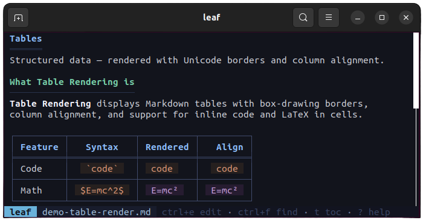

### Sélecteur de thèmes

Choisissez parmi 4 thèmes intégrés avec prévisualisation en temps réel pendant la navigation. Chaque thème s'applique à l'interface, aux éléments Markdown et à la coloration syntaxique simultanément.

- Appuyez sur `Shift+T` pour ouvrir le sélecteur de thèmes
- Thèmes disponibles : Arctic, Forest, Ocean Dark, Solarized Dark
- Appuyez sur `Esc` pour annuler et restaurer le thème d'origine

Source: [demo-theme-picker.md](sources/demo-theme-picker.md)

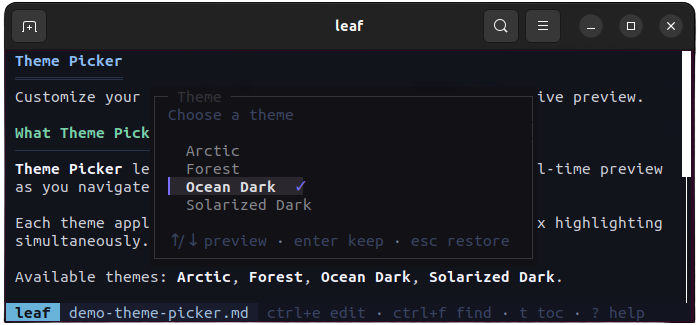

### Navigation

Naviguez dans les documents avec les raccourcis clavier ou la souris. La barre de défilement à droite supporte le clic et le glisser-déposer pour un positionnement rapide.

- `j`/`k` ou flèches : défiler ligne par ligne
- `d`/`u` ou PageDown/PageUp : défiler par page
- `g`/`Shift+G` ou Home/End : aller au début/fin
- Molette de la souris : défilement de 3 lignes par cran
- Barre de défilement : cliquez et glissez pour naviguer rapidement

Source: [demo-navigation.md](sources/demo-navigation.md)

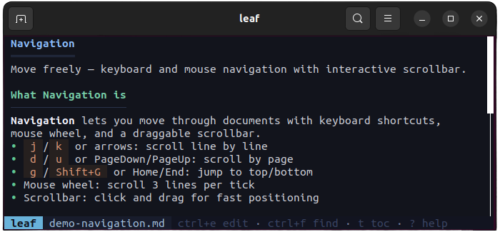

**Et aussi :**
- **Blockquotes** : imbrication multi-niveaux avec marqueurs verticaux, texte en italique, peut contenir des listes et du code
- **Listes imbriquées** : puces Unicode par niveau (puce, cercle, triangle), couleurs distinctes, listes ordonnées avec numérotation
- **Titres** : H1 souligné avec double ligne, H2 avec ligne simple, H3 en gras, H4+ avec couleurs distinctes
- **Formatage inline** : **gras**, *italique*, ~~barré~~, `code inline`, liens avec icône
