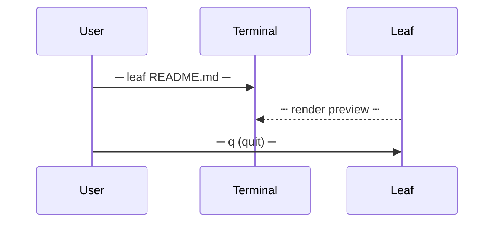

# Mermaid Diagrams

Visualize flows — diagrams rendered as ASCII art in the terminal.

## What Mermaid Rendering is

**Mermaid Rendering** converts diagram definitions into visual ASCII art right in the terminal — no browser or image viewer needed.

## Sequence Diagram

